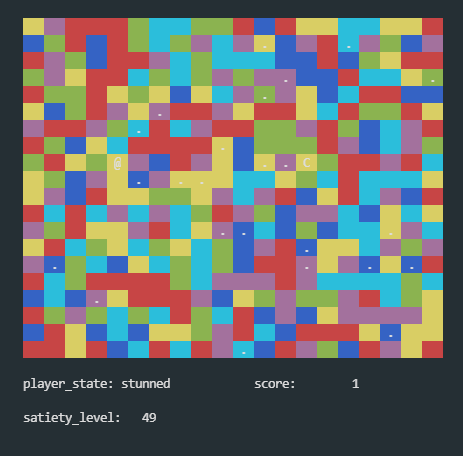

# eat_the_chicken
Simple tag game with complex rules. It runs on terminal.



This was inspired by [color puzzle](https://undertale.fandom.com/wiki/Multicolor_Tile_Puzzle) in Undertale.

All effects of tiles are corresponding to those in that game.

## Install (Ubuntu)

```bash
sudo apt-get install ncurses-doc
sudo apt-get install libncursesw5-dev
```

## Usage(Ubuntu)

```bash
g++-9 -I /usr/include/ncursesw main.cpp -l ncursesw;
```
